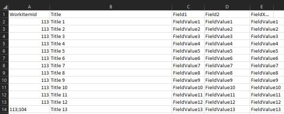

# Import CSV file to work item discussions
This extension provides the ability to import a CSV files contents as discussion comments to selected Work Items.

The extension takes a file which looks something like the following :

Ensure the source CSV file follows the following conventions.

**Mandatory fields:**
1. WorkItemId - The Id for the Work item which we will add a new discussion comment to, use semi-colon to specify multiple ids.
1. Title - The title to be used in the table which we will render for the discussion comment.

**File format:**
- Comma delimited file.
- Strings quoted with double quotes.

The import can be triggered from various locations in the Azure Boards UI :
- Work item query menu
- Work item query results toolbar menu
- Work item query results menu item
- Work item for context menu

Once imported your CSV Data will be rendered as a table in the work item discussion thread as seen below :

This extension can be leveraged for various scenarios, for example providing status on work you are tracking from an external system.
